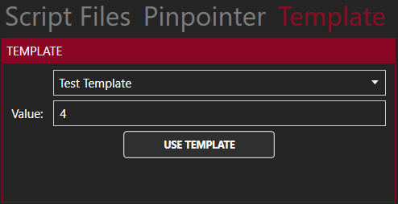
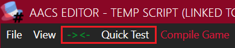

[Back to overview](index.md)

---
# Code Editor

---

> **IMPORTANT! Note that some of the information in this article might be outdated. In case you find any contradictions, please raise an Objection! in the \#support channel of the developer's [Discord server](https://discord.com/invite/h6ByVmgf).**

The Code Editor (or Editor for short) is a tool designed to aid case makers in editing AACS files (`.aacs`). This section serves as a quickstart guide for the Code Editor.

## Overview

This is the main scripting window.

In the top left section of the screen, there are two menu entries: "File" and "View"  
- The "File" menu opens the option for common commands in a text editor. The "Save as Template" option will be discussed later.  
  
  
  
- The "View" menu gives you three options to adjust certain visual aspects of the Editor.  
  
  

## Syntax Highlighting

The Editor has syntax highlighting as well and highlights Instructions, punctuation, strings, booleans, and numbers for ease of reading.

## File Browser

The Editor also features a small file browser which can be seen on the right side. Only scripts can be managed here when a project is linked to the Editor.

In the file browser you can only see folders and .aacs files. This allows you to manage multiple script files for a single project while in the Code Editor. A file can be opened by double-clicking it.

Clicking and then right-clicking on an item will reveal additional options, depending on the selected item.
|Option|Description|Chapters|Folders|Script files|
|:---:|:---:|:----:|:----:|:---:|
|New Script|Creates a new script in the selected chapter/folder|✓|✓|✗|
|New Folder|Creates a new folder in the selected chapter/folder|✓|✓|✗|
|New Chapter|Creates a new chapter|✓|✗|✗|
|Delete|Deletes the selected item|✓|✓|✓|
|Open Folder|Opens the folder/chapter in File Explorer|✓|✓|✗|

> Note: At the moment, some of these options (New Chapter, Open Folder) do not work correctly and only show up when clicking on the empty space below the items in the file browser

## Templates

Templates are snippets of script that you want to use multiple times. They are stored as normal .aacs files.

In order to add a Template, you must create it via the Editor and then click on "Save as Template" in the "File" menu. The script will be saved in a "Templates" subfolder of the folder in which the Code Editor is located.

In order to insert a Template in your script, you must go to the "Template" tab of the side menu on the right side of the Editor. Then you must select the Template you want to insert and click on "Use Template".

You can also add a placeholder, `%VALUE%`, to templates. This placeholder is case-sensitive, which it only works if it's written entirely in uppercase. You can use it for dynamic values that might change depending on the context in which you are using the Template. Any value can be entered in the input field labeled "Value", and after hitting the "Use Template" button every placeholder is replaced by the specified value.

## Toolbar
The toolbar next to the "View" menu entry contains two options.

The first option is for commenting out a highlighted section of the script. This currently only works one way, so you can comment out a highlighted section, but in order to reverse this you must manually remove the comment tags (`->` `<-`). Sections that are commented out are ignored when compiling and Quick Testing.

The second option, labeled "Quick Test", executes a highlighted section of Instructions in the script. If you don't highlight anything and simply press "Quick Test", then the whole script will be run.

In order to use Quick Test, you must have a linked project so that the Editor is able to find the necessary assets. In order to link a project, you must open a project (.aact) from the Asset Maker. You can do that from a button at the top of the Asset Maker window.

This will open the code editor and link a project to it. The actual use of the editor won't change, it will just enable the Quick Test function.
If a project is linked, the name of it will be present in the title of the window in the form of a message saying "(Linked to PROJECT)".

## Compiling the game
>
The "Compile Game" next to the toolbar will compile a releaseable version of your game. The Data.aact and all linked scripts will be compiled into a Windows Executable (.exe) file in the Exports folder of the AACT directory. If the button "Compile Game" appears green, that means there have been no changes since the last time the game was compiled. Clicking it while it is green will open the folder of the game. If it appears red, that means changes have been made and the game be recompiled. This option is not available if no project is linked.

## Code Completion

Code Completion allows you to type the name of an instruction into a shortcut window and have the engine automatically complete the instruction in the script for you. This feature can be accessed by typing Shift+Space or CTRL+T.

After pressing either of these keybinds, a list of instructions will appear. Beginning to type the desired instruction will narrow the list of instructions down based on your input. Certain instructions may appear twice if they have a shortened version, such as LoadScene.

Once the correct instruction is highlighted, hit enter to complete the instruction in the script.

## Pinpointer

Certain instructions, such as SelectSpot, require X and Y coordinates on the game screen to function as intended. The pinpointer is a tool to allow you to easily find and record these coordinates.

Moving your cursor over the black area in the pinpointer will display the X and Y coordinates of it as if it were on the game screen. Left clicking the screen will place a SelectSpot instruction in the script with the cursor's coordinates already inputted as parameters. Right clicking will allow you to change the background of the pinpointer.

## Script Inclusion & Compiler Instructions

Compiler Instructions are a special type of instruction that do not affect gameplay, but are integral to creating games with AACT.

Currently, only one Compiler Instruction has been added: the @Include Instruction. It is not necessary to know the technical details of what the compiler does with this Instruction, but it's useful to know how to use it.

This script contains the @Include compiler instruction:  
  
Compiler Instructions, unlike all other types of Instruction, always start with an @ and **do NOT end with a semicolon (;)**. When an @Include Instruction is encountered, the designated script file is loaded and executed at that position. In this case, "Trial1.aacs" would be loaded and executed. This Instruction can be placed anywhere in the script, and also works while debugging.

The benefit of this is that the 2GB limit of a single script file can be circumvented by loading other scripts. This Instruction is also the reason why there must always be a Prelude.aacs file in your project. Prelude.aacs is the first script that will be executed by the compiler, and it is automatically added when a new project file is created. It must **NOT** be deleted. If it is not present, the game will not compile.

---
[Back to overview](index.md)
